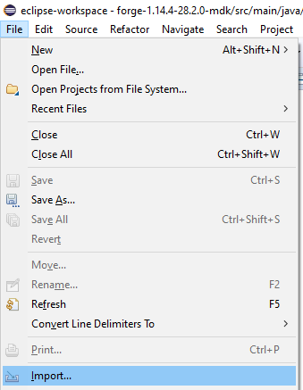
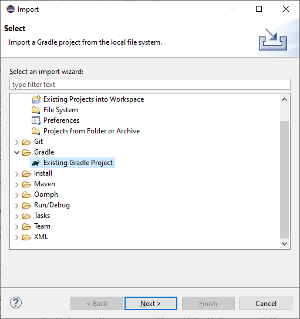
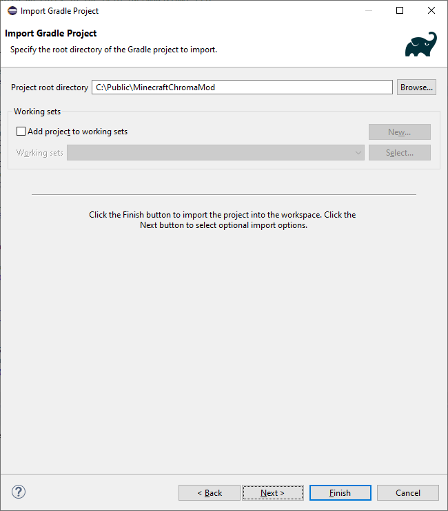
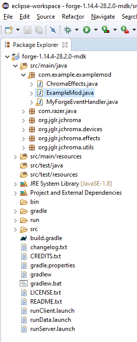
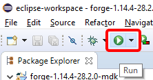
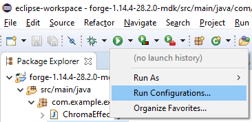
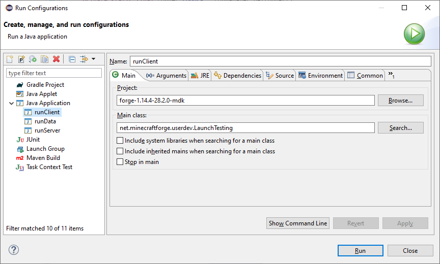

# Minecraft Chroma Mod

This Mod is built with [MinecraftForge](https://minecraftforge.net) and displays `Chroma RGB` effects for various game events.

[JChromaSDK.java](https://github.com/tgraupmann/MinecraftChromaMod/blob/master/src/main/java/com/razer/java/JChromaSDK.java) exposes the C++ `CChromaEditor` library functions for `Java`.

`JChromaSDK` is able to play Razer Chroma animations from the [Project Resources](https://github.com/tgraupmann/MinecraftChromaMod/tree/master/src/main/resources/Animations).


## Table of Contents

* [See Also](#see-also)
* [Chroma Effects](#chroma-effects)
* [Videos](#videos)
* [Quick Setup](#quick-setup)

## See Also

**Docs:**

- [Chroma Animation Guide](http://chroma.razer.com/ChromaGuide/) - Visual examples of the Chroma Animation API methods

**Apps:**

- [ChromaClientForDiscord](https://github.com/tgraupmann/ChromaDiscordApp) - Add Chroma lighting to the Discord App events

- [ChromaClientForTwitch](https://github.com/tgraupmann/ChromaTwitchExtension) - Add Chroma lighting to the Twitch streaming experience

**Plugins:**

- [CChromaEditor](https://github.com/RazerOfficial/CChromaEditor) - C++ native MFC library for playing and editing Chroma animations

- [GameMakerChromaExtension](https://github.com/RazerOfficial/GameMakerChromaExtension) - GameMaker extension to control lighting for Razer Chroma

- [Godot_ChromaSDK](https://github.com/RazerOfficial/Godot_ChromaSDK) - Godot native library for playing Chroma animations

- [HTML5ChromaSDK](https://github.com/RazerOfficial/HTML5ChromaSDK) - JavaScript library for playing Chroma animations

- [UE4_XDK_SampleApp](https://github.com/razerofficial/UE4_XDK_SampleApp) - UE4 Chroma samples and runtime module with Blueprint library for the ChromaSDK

- [UnityNativeChromaSDK](https://github.com/RazerOfficial/UnityNativeChromaSDK) - Unity native library for the ChromaSDK


## Chroma Effects ##

* Base Effect

* Main Menu Effect

* In Water Effect

* Place Block Effect

* Craft Item Effect

* Player Damage Effect

* Fire Arrow Effect

* Kill Pig Effect

* Kill Chicken Effect

* Open Chest Effect

* Open Door Effect

* Close Door Effect

* Sword Attack Effect

* Spawn Fish Effect

* Potion Effect

* Raining Effect

* Snowing Effect

* Ladder Effect

* Riding Cart Effect


## Videos ##

**Intro Video**

<a target="_blank" href="https://youtu.be/0Y731q8HrPs"></a>


**More Chroma Effects**

<a target="_blank" href="https://youtu.be/7Ey3PRJa72Y"></a>

**Weather**

<a target="_blank" href="https://youtu.be/kFtd75cmfeo"></a>


## Quick Setup

* Install [JDK 1.8 or better](https://www.oracle.com/technetwork/java/javase/downloads/jdk8-downloads-2133151.html)

* You can also use [OpenJDK](https://adoptopenjdk.net/?variant=openjdk8&jvmVariant=hotspot). Use `OpenJDK 8 (LTS)`

* Set the `JAVA_HOME` environment variable to the path of the 64-bit version of the JDK. Gradle will report out of memory with the 32-bit JDK version which can be fixed in the `gradle.properties` file if you have to.

* Install the latest MinecraftForge `server` and `client` using the [Windows Installer for 1.16.3](https://files.minecraftforge.net/maven/net/minecraftforge/forge/1.16.3-34.1.0/forge-1.16.3-34.1.0-installer.jar)

**Above: Install the Server and Client**

* Make sure you do both for the Minecraft Forge handshake to work.

* That means double-click `forge-1.16.3-34.1.0-installer.jar` and use the UI to install both.

**Get the mod**

* Download and extract to a folder like:
```C:\Minecraft\forge-1.16.3-34.1.0-mdk```

* Make sure the path isn't too long to avoid compile errors.


**Generate Eclipse Project**

```
gradlew genEclipseRuns
```

**Launch Eclipse**

**Use the `File->Import` menu item**



**Select `Gradle\Existing Gradle Project` and click `Next`**



**Browse to the `MinecraftChromaMod` folder and click `Finish`**



**If the import is successful, the project shouldn't have any compile errors.**



**Use the `Run` toolbar drop down**



**Select `Run Configurations...`**



**Start the mod (from Eclipse)**

* Select the `Java Application` -&gt; `runClient` and click `Run`



**Start the mod (on the command-line)**

```
gradlew runClient
```

**Build the `build\libs\modid-1.0.jar`**

```
gradlew build
```

**Build the installer with InnoSetup**

## Support

Contact `Tim Graupmann#0611` on Discord for mod support.
